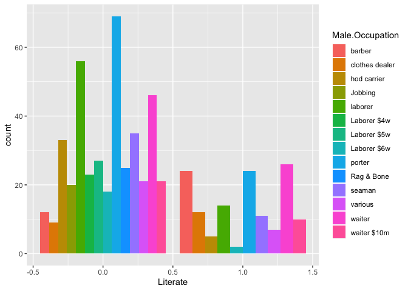
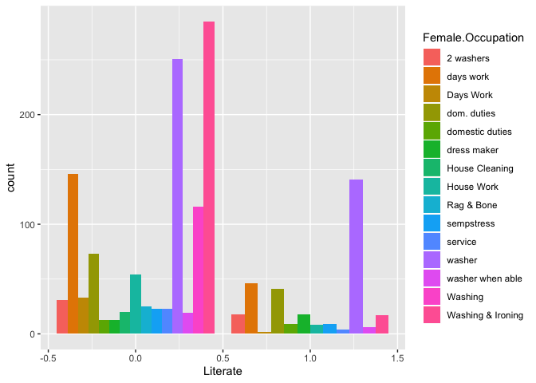
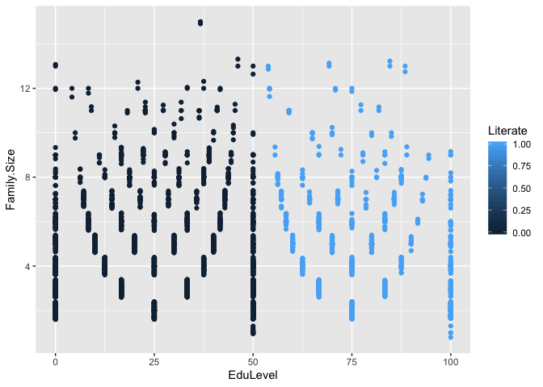
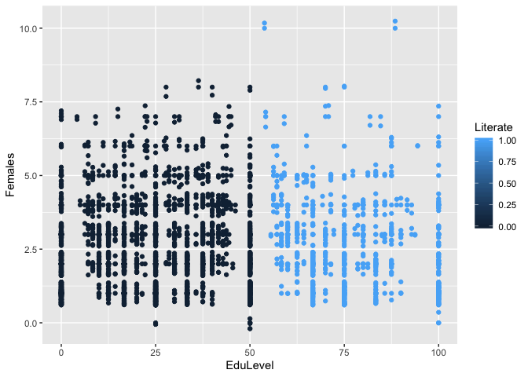
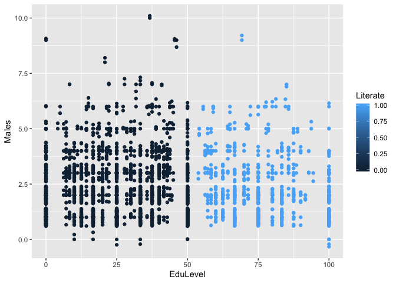
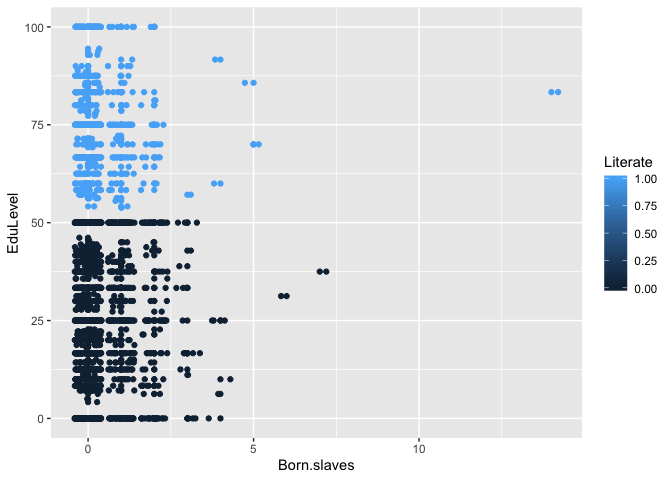

Introduction
------------

Throughout history, African Americans have faced numerous limitations and restrictions to their rights as Americans. The institution of slavery proved a crucial impediment to not only their freedom, but also their achievement. As a result of chattel slavery, African Americans were denied the most basic of rights and opportunities.

Historical myths would have us believe that the American north was synonymous with freedom and that once there, African Americans experienced full freedom and inclusion within American society. In fact, we know that life in the north presented its own challenges for African Americans and the lives they sought to create for themselves. I have attempted to use data science to better help capture and illustrate the

Census data from Philadelphia will provide the basis for our evaluation and prediction. In 1847, the United States had not yet confronted the institution of slavery or its consequences. At that point, almost 20 years before the start of the American Civil War, northern states of the relatively new republic had only recently freed those enslaved within their borders. Northern cities like Philadelphia, PA were regarded as havens for fugitive slaves and places were Blacks could live and actually experience freedom.

The data set helps us to gain insights into the lives of Black Philadelphians at the time. It includes census information concerning family size, the numbers of males and females residing in a household, their occupations, whether or not they were born in the state or not, whether or not they were born into slavery or not, and their ability to read and/or write.

In order to explore the potential relationships between several variables related to the status of African Americans in Philadeplhia in 1847,we must start off by reading the census data.

``` r
library(tidyverse) #The swiss knife!
library(caret)
```

Now that the packages are loaded, we can get the data into R.

``` r
census <- read.csv("census3.csv")
```

Exploratory Data Analysis
-------------------------

Now that we have ingested the data, let us start exploring it. The first thing to do is to have a quick look at our data. For that, we can use the `str()` function or the more human readable (and intuitive), `glimpse()` function.

``` r
glimpse(census)
```

    ## Observations: 2,851
    ## Variables: 11
    ## $ X                 <int> 1, 2, 4, 5, 7, 9, 15, 16, 17, 19, 20, 23, 26, …
    ## $ Family.Size       <int> 3, 3, 6, 7, 4, 3, 3, 4, 2, 6, 2, 3, 2, 4, 2, 2…
    ## $ Males             <int> 1, 2, 1, 5, 3, 1, 1, 2, 1, 4, 1, 2, 1, 2, 1, 1…
    ## $ Females           <int> 2, 1, 5, 2, 1, 2, 2, 2, 1, 2, 1, 1, 1, 2, 1, 1…
    ## $ Natives           <int> 2, 1, 2, 6, 2, 1, 1, 1, 1, 5, 0, 3, 0, 2, 0, 1…
    ## $ Not.Natives       <int> 1, 2, 4, 1, 2, 2, 2, 3, 1, 1, 2, 0, 2, 2, 2, 1…
    ## $ Male.Occupation   <fct> Watchman, 1 lab 1 Waterman, drives dray, Barbe…
    ## $ Female.Occupation <fct> Washer, Washer, eating house, domestic duties,…
    ## $ Born.slaves       <int> 1, 0, 1, 0, 0, 0, 0, 0, 0, 0, 1, 0, 1, 1, 0, 0…
    ## $ Can.read          <int> 1, 1, 0, 5, 2, 1, 1, 2, 1, 5, 0, 1, 1, 3, 0, 2…
    ## $ Can.write         <int> 1, 1, 0, 5, 2, 1, 1, 2, 1, 5, 0, 2, 0, 3, 0, 2…

Now we can begin exploring the data. The first thing to do is to have a quick look at it, noticing that there are 2851 rows in our dataset with 11 variables. It added the `X1` variable on its own while importing the data. Not only can we see the variables, but we also now know the type of variables, for example, `Male Occupation` is a characteer variable. Should it be a factor?based on the numerous observations and 11 variables, it is obvious that the data must be cleaned in order to make it more manageable and readable.

While carrying out any analysis, it is always best to start off with a question. It is also important to know the metadata, or the data that describes the data. For example, we see the variable `Can.read` has values ranging from 0 to 5 (we will of course check this), but have no idea what these values mean. We may have assumed that this might be a binary value with 0 indicating the person cannot read and 1 indicating that the person can read. Or this could also mean the total number of people in a household who can read (that sounds more plausible to me). Either way, we will look at the metadata or a data dictionary, if one exists. we can also observe the different values available in the `Can.read` and `Can.write` variables.

``` r
table(census$Can.read)
```

    ## 
    ##   0   1   2   3   4   5   6   7   8   9  10  11  12  23  31 
    ## 784 585 690 333 206 126  52  44  14   8   3   2   1   1   2

``` r
table(census$Can.write)
```

    ## 
    ##   0   1   2   3   4   5   6   7   8   9  11 
    ## 976 832 511 250 116  71  51  27   9   5   3

Looking at this, we are now more inclined to think that these two variables show us the number of people who can read or write in a family. So with these assumptions, what are the questions that come to mind? Personally I would really like to understand the impact of proffessions, gender and other variables available, on the level of education. For the 'level of education' we have two variables available, viz. `Can.read` and `Can.write`. we also know the size of a family. So perhaps it would be best to divide these two variables with the size of the family and look at this as a percentage to say what percent of a family is well versed with reading or writing. Prior to that we also want to check for discrepancies in the dataset. Given the family size, the sum of the Males and Females should be equal to the family size, considering this era only provided binary options for gender.

``` r
#Create a new variable called GenderSum and then look at the difference
census <- census %>% mutate(
  GenderSum = Males + Females,
  FamDiff = `Family.Size` - GenderSum
)

which(census$FamDiff > 0)
```

    ##  [1]   71   78   95  105  145  178  295  368  421  428  432  651  787  868
    ## [15] 1008 1054 1487 1523 1557 1964 2472

There are about 21 values that don't quite match up. Row 71 provides an example. While it says that the family size is 5, it has only 1 male and 2 females. This doesn't quite add up. So maybe removing these values and the two additional columns we created, as well as the `X1` column.

``` r
census <- census %>% filter(FamDiff == 0) %>% select( -GenderSum, -FamDiff)
```

Now we can mutate a new variable based on the percentages discussed above.

``` r
census <- census %>% mutate(
  Read = round((Can.read/`Family.Size`)* 100, 2),
  Write = round((Can.write/`Family.Size`)* 100, 2)
)
```

We could also perhaps combine these two newly created variables and have one cummulative variable which is just the mean of these two, to signify the overall education level. After creating this new variable we won't need the original variables.

``` r
census <- census %>% mutate(
  EduLevel = round((Read + Write)/2, 2) 
) 
```

We must also check and see that our `EduLevel` is not greater that 100%.

``` r
which(census$EduLevel > 100)
```

    ## [1]  144  165  189  238  392  475 1220

Looking at row 144, we see that the family size is 3, but the number of people who can read or write is 6 and 4 respectively. This alerts me to the fact that something is wrong here. We will need to filter for only those values that are less than or equal to 100.

``` r
census <- census %>% filter(EduLevel <= 100) %>% select(-(Can.read:Write))
```

Ok, so far so good. Now we must address the task of making some sense of the male and female occupations. There are too many occupations and so they need to be reduced. The remainder of this analysis focuses on education level, literacy, and occupations. The data frame (census\_glm.csv) below includes a variable labeled literate. If a family has above a 50% education level, then the family is literate. A (1) in the literate column specifies that a family is literate and a (0) means that the family is not literate.

``` r
census_glm<- read.csv("census_glm.csv")
```

Additional variables are included in the data file. These variables are removed using the code that follows.

``` r
census_glm<-select(census_glm, -c(X.1, X))
```

Using plots and graphs, we explore the data with these nine questions in mind.These questions can help us to think about the data.

1.  What was the most common profession for males?
2.  Waht was the most common profession for females?
3.  How do these professions measure up when viewed from the education level?
4.  Which is the least educated profession?
5.  Which is the most educated profession?
6.  Is there a relationship between family size and Education Level?
7.  Is there any difference between genders as far as education level is concerned?
8.  Does being born a slave have any bearing on the education level?

``` r
census_glm %>% group_by(Male.Occupation) %>% count() %>% arrange(desc(n))
```

    ## # A tibble: 1,426 x 2
    ## # Groups:   Male.Occupation [1,426]
    ##    Male.Occupation     n
    ##    <fct>           <int>
    ##  1 porter             93
    ##  2 waiter             72
    ##  3 laborer            70
    ##  4 seaman             46
    ##  5 hod carrier        38
    ##  6 barber             36
    ##  7 waiter $10m        31
    ##  8 various            28
    ##  9 Laborer $5w        27
    ## 10 Rag & Bone         25
    ## # … with 1,416 more rows

``` r
census_glm %>% group_by(Female.Occupation) %>% count() %>% arrange(desc(n))
```

    ## # A tibble: 796 x 2
    ## # Groups:   Female.Occupation [796]
    ##    Female.Occupation     n
    ##    <fct>             <int>
    ##  1 washer              392
    ##  2 Washing & Ironing   302
    ##  3 days work           192
    ##  4 Washing             116
    ##  5 dom. duties         114
    ##  6 House Work           62
    ##  7 2 washers            49
    ##  8 Days Work            35
    ##  9 sempstress           32
    ## 10 dress maker          31
    ## # … with 786 more rows

The occupation with the largest number of males is porter. Since there are 1,426 different occupations, a filter is created to include only occupations that have at least 20 male family members. When viewing the occupations for females, it seems that more females seem to hold a position than males. This observation was fascinating to me as the male in modern times is viewed as the family provider. The most popular female position held is a washer. There are 392 women washers in the data set. Since there are 796 different occupations, a filter is created to include only occupations that have at least 20 female family members.The results are printed to the consoloe.

``` r
male.occ_count <- census_glm %>% group_by(Male.Occupation) %>% count() %>% filter(n > 19) %>% arrange(desc(n))
female.occ_count <- census_glm %>% group_by(Female.Occupation) %>% count() %>% filter(n > 19) %>% arrange(desc(n))
male.occ_count
```

    ## # A tibble: 14 x 2
    ## # Groups:   Male.Occupation [14]
    ##    Male.Occupation     n
    ##    <fct>           <int>
    ##  1 porter             93
    ##  2 waiter             72
    ##  3 laborer            70
    ##  4 seaman             46
    ##  5 hod carrier        38
    ##  6 barber             36
    ##  7 waiter $10m        31
    ##  8 various            28
    ##  9 Laborer $5w        27
    ## 10 Rag & Bone         25
    ## 11 Laborer $4w        23
    ## 12 clothes dealer     21
    ## 13 Jobbing            20
    ## 14 Laborer $6w        20

``` r
female.occ_count
```

    ## # A tibble: 15 x 2
    ## # Groups:   Female.Occupation [15]
    ##    Female.Occupation     n
    ##    <fct>             <int>
    ##  1 washer              392
    ##  2 Washing & Ironing   302
    ##  3 days work           192
    ##  4 Washing             116
    ##  5 dom. duties         114
    ##  6 House Work           62
    ##  7 2 washers            49
    ##  8 Days Work            35
    ##  9 sempstress           32
    ## 10 dress maker          31
    ## 11 service              27
    ## 12 Rag & Bone           25
    ## 13 washer when able     25
    ## 14 domestic duties      22
    ## 15 House Cleaning       20

This filter seems to be a good one. Now we can take a deeper dive into the data to determine education level by occupation. A comparison among occupations answers question 1. The results will be displayed as a bar graph.

``` r
ggplot(census_glm %>% filter(Male.Occupation %in% unique(male.occ_count$Male.Occupation)),
       aes(x = Literate, fill = Male.Occupation)) + geom_bar(position = 'dodge')
```



``` r
ggplot(census_glm %>% filter(Female.Occupation %in% unique(female.occ_count$Female.Occupation)),
       aes(x = Literate, fill = Female.Occupation)) + geom_bar(position = 'dodge')
```



Of the 14 chosen male occupations, families that have male porters have the highest illiteracy level. If a family has a male waiter, then the family is more likely to be literate. Females that hold a position washing and ironing have the least educated families. However, families that have female washers have higher family literacy levels.

Attention is shifting to determining a relationship between the variables. We observe the relationship between family size and education level. A color scheme is used to distinguish between the literate and non-literate groups easily.

``` r
ggplot(census_glm, aes(x = EduLevel, y = Family.Size, color=Literate)) +

  geom_point() + geom_jitter()
```



An interesting relationship between the variables is recognized. The relationship seems to be parabolic.

``` r
ggplot(census_glm, aes(x = EduLevel, y = Females, color=Literate)) +

  geom_point() + geom_jitter()
```



``` r
ggplot(census_glm, aes(x = EduLevel, y = Males, color=Literate)) +

  geom_point() + geom_jitter()
```



``` r
ggplot(census_glm, aes(x = Born.slaves, y = EduLevel, color=Literate)) +

  geom_point() + geom_jitter()
```



Considering question number 8, we draw a table to capture information to answer the question and to confirm the results from the graph above.

``` r
census_glm %>% group_by(Literate, Born.slaves) %>% count() 
```

    ## # A tibble: 14 x 3
    ## # Groups:   Literate, Born.slaves [14]
    ##    Literate Born.slaves     n
    ##       <int>       <int> <int>
    ##  1        0           0  1710
    ##  2        0           1   301
    ##  3        0           2   102
    ##  4        0           3    19
    ##  5        0           4     6
    ##  6        0           6     1
    ##  7        0           7     1
    ##  8        1           0   514
    ##  9        1           1    87
    ## 10        1           2    26
    ## 11        1           3     1
    ## 12        1           4     2
    ## 13        1           5     3
    ## 14        1          14     1

Out of 2242 study participants, 1710 were born slaves and are in a household that is deemed to be illiterate while 514 of the participants that were taken as slaves have literate families. Occupation is discussed next.

Machine Learning
----------------

In this section, we are only going to focus on the top five occupations for females and males as there are too many occupations and the model may not converge. The top means the occupations with the largerest n. A new dataframe with filters is created.

``` r
census_glm<- read.csv("census_glm.csv")
df <- census_glm %>% filter( 
  Female.Occupation %in% female.occ_count$Female.Occupation[1:5],
Male.Occupation %in% male.occ_count$Male.Occupation[1:5]) 
df
```

    ##      X.1    X Family.Size Males Females Natives Not.Natives
    ## 1      9   17           2     1       1       1           1
    ## 2     14   27           4     2       2       2           2
    ## 3     16   30           2     1       1       1           1
    ## 4     17   31           2     1       1       0           2
    ## 5     24   54           6     3       3       5           1
    ## 6     26   61           4     1       3       3           1
    ## 7     27   64           4     1       3       1           3
    ## 8     29   66           6     3       3       5           1
    ## 9     41   85           6     1       5       1           5
    ## 10    43   87           2     1       1       0           2
    ## 11    50   99           7     2       5       5           2
    ## 12    78  145           3     1       2       3           0
    ## 13    82  151           4     3       1       2           2
    ## 14    84  154           8     3       5       7           1
    ## 15    91  165           2     1       1       0           2
    ## 16   102  181           4     1       3       0           4
    ## 17   109  192           2     1       1       0           2
    ## 18   121  212           6     4       2       6           0
    ## 19   130  243           4     2       2       3           1
    ## 20   131  244           7     2       5       0           0
    ## 21   145  269           6     3       3       4           2
    ## 22   192  357           6     2       4       4           2
    ## 23   240  428           5     2       3       3           2
    ## 24   246  435           4     2       2       4           0
    ## 25   258  453           3     1       2       3           0
    ## 26   264  463           5     3       2       0           5
    ## 27   273  485           3     1       2       1           2
    ## 28   283  502           4     2       2       1           3
    ## 29   294  519           3     2       1       1           2
    ## 30   298  524           3     2       1       0           0
    ## 31   307  538           2     1       1       0           2
    ## 32   320  567           5     1       4       1           4
    ## 33   405  694           4     2       2       3           0
    ## 34   407  696           3     2       1       0           0
    ## 35   469  791           5     2       3       4           1
    ## 36   488  821           2     1       1       0           2
    ## 37   490  824           4     3       1       2           2
    ## 38   503  849           2     1       1       0           2
    ## 39   525  891           3     1       2       0           3
    ## 40   530  903           3     2       1       1           2
    ## 41   536  914           4     2       2       0           4
    ## 42   538  916           2     1       1       1           1
    ## 43   551  934           4     2       2       3           1
    ## 44   563  964           3     1       2       1           2
    ## 45   570  980           3     2       1       0           3
    ## 46   572  986           3     1       2       1           2
    ## 47   593 1021           3     1       2       3           0
    ## 48   596 1025           3     2       1       1           2
    ## 49   602 1032           2     1       1       0           2
    ## 50   610 1044           2     1       1       0           2
    ## 51   626 1071           4     3       1       1           3
    ## 52   642 1087           4     2       2       2           2
    ## 53   656 1113           5     3       2       5           0
    ## 54   657 1115           4     3       1       2           2
    ## 55   658 1117           6     3       3       3           3
    ## 56   664 1125           3     2       1       1           1
    ## 57   666 1129           7     4       3       5           2
    ## 58   667 1131           2     1       1       0           2
    ## 59   701 1191           9     4       5       5           4
    ## 60   712 1227           6     2       4       0           6
    ## 61   728 1258           2     1       1       0           0
    ## 62   740 1279           5     2       3       5           0
    ## 63   756 1306           4     1       3       0           4
    ## 64   769 1325           3     2       1       3           0
    ## 65   789 1353           6     4       2       1           5
    ## 66   795 1365           2     1       1       0           1
    ## 67   803 1378           4     1       3       3           1
    ## 68   811 1387           2     1       1       0           2
    ## 69   813 1390           4     1       3       2           2
    ## 70   815 1394           3     1       2       0           3
    ## 71   830 1419           3     2       1       1           2
    ## 72   838 1429           2     1       1       0           2
    ## 73   840 1432           2     1       1       1           1
    ## 74   875 1483           4     2       2       2           2
    ## 75   880 1491           2     1       1       0           2
    ## 76   905 1530          10     6       4       9           1
    ## 77   914 1543           8     4       4       7           1
    ## 78   922 1553           4     2       2       2           2
    ## 79   923 1554           4     2       2       2           2
    ## 80   941 1582           8     2       6       7           1
    ## 81   945 1586           3     1       2       1           2
    ## 82   948 1592           3     1       2       1           2
    ## 83   963 1613           4     1       3       1           3
    ## 84   972 1632           3     2       1       1           2
    ## 85   973 1633           4     1       3       0           4
    ## 86   975 1635           5     2       3       2           1
    ## 87   983 1644           2     1       1       0           2
    ## 88   999 1669           5     3       2       5           0
    ## 89  1004 1682           2     1       1       0           2
    ## 90  1021 1707           4     2       2       4           0
    ## 91  1026 1712           4     1       3       4           0
    ## 92  1027 1713           2     1       1       0           0
    ## 93  1028 1714           4     1       3       2           2
    ## 94  1037 1726           5     3       2       3           2
    ## 95  1061 1763           2     1       1       0           2
    ## 96  1080 1795           3     1       2       1           2
    ## 97  1092 1814           3     2       1       1           2
    ## 98  1093 1818           6     3       3       5           1
    ## 99  1096 1825           3     2       1       1           2
    ## 100 1099 1833           2     1       1       0           2
    ## 101 1100 1839           4     2       2       3           1
    ## 102 1101 1841           4     2       2       1           1
    ## 103 1103 1847           4     2       2       2           2
    ## 104 1105 1851           3     2       1       1           2
    ## 105 1106 1852           3     1       2       0           3
    ## 106 1107 1854           3     1       2       2           1
    ## 107 1110 1861           5     4       1       4           1
    ## 108 1111 1863           2     1       1       2           0
    ## 109 1116 1871           2     1       1       0           2
    ## 110 1123 1884           2     1       1       0           2
    ## 111 1127 1890           3     2       1       3           0
    ## 112 1129 1894           2     1       1       0           2
    ## 113 1133 1899           2     1       1       0           2
    ## 114 1134 1900           3     2       1       1           2
    ## 115 1138 1910           4     2       2       1           2
    ## 116 1151 1936           2     1       1       0           2
    ## 117 1157 1948           2     1       1       1           1
    ## 118 1162 1962           2     1       1       1           1
    ## 119 1182 1993           5     3       2       3           2
    ## 120 1183 1995           5     3       2       5           0
    ## 121 1204 2024           5     3       2       3           2
    ## 122 1205 2026           5     3       2       5           0
    ## 123 1228 2062           3     1       2       1           2
    ## 124 1232 2067           3     1       2       2           1
    ## 125 1242 2081           2     1       1       0           2
    ## 126 1256 2109           3     1       2       1           2
    ## 127 1261 2118           4     3       1       4           0
    ## 128 1268 2134           3     1       2       1           2
    ## 129 1277 2152           4     3       1       3           1
    ## 130 1281 2157           2     1       1       0           2
    ## 131 1283 2161           2     1       1       0           2
    ## 132 1290 2172           3     1       2       2           1
    ## 133 1311 2217           3     1       2       1           2
    ## 134 1324 2238           2     1       1       0           2
    ## 135 1343 2270           3     2       1       0           0
    ## 136 1355 2288           3     1       2       1           2
    ## 137 1356 2290           2     1       1       0           2
    ## 138 1358 2292           2     1       1       0           2
    ## 139 1359 2293           2     1       1       2           0
    ## 140 1360 2294           3     2       1       1           2
    ## 141 1363 2298           2     1       1       0           2
    ## 142 1377 2324           2     1       1       0           0
    ## 143 1383 2337           3     1       2       1           2
    ## 144 1386 2341           7     5       2       6           1
    ## 145 1388 2343           4     2       2       2           2
    ## 146 1401 2361           2     1       1       0           2
    ## 147 1403 2363           2     1       1       0           2
    ## 148 1410 2371           4     2       2       4           0
    ## 149 1415 2377           2     1       1       1           1
    ## 150 1418 2384           2     1       1       0           0
    ## 151 1420 2389           3     2       1       0           3
    ## 152 1422 2393           4     1       3       1           3
    ## 153 1424 2397           2     1       1       1           1
    ## 154 1431 2408           4     2       2       0           4
    ## 155 1432 2409           3     2       1       0           3
    ## 156 1438 2415           2     1       1       2           0
    ## 157 1443 2420           2     1       1       0           2
    ## 158 1452 2431           5     2       3       5           0
    ## 159 1463 2445           3     1       2       3           0
    ## 160 1466 2448           4     2       2       4           0
    ## 161 1475 2459           6     3       3       4           2
    ## 162 1476 2460           7     2       5       2           5
    ## 163 1482 2468           3     1       2       2           1
    ## 164 1485 2472           4     2       2       2           2
    ## 165 1490 2477           2     1       1       0           2
    ## 166 1500 2493           3     2       1       2           1
    ## 167 1502 2498           4     3       1       2           2
    ## 168 1503 2499           3     1       2       1           2
    ## 169 1507 2505           5     1       4       4           1
    ## 170 1508 2507           8     4       4       7           1
    ##     Male.Occupation Female.Occupation Born.slaves EduLevel Literate
    ## 1           laborer            washer           0    50.00        0
    ## 2            seaman            washer           1    75.00        1
    ## 3           laborer         days work           0   100.00        1
    ## 4            porter         days work           0     0.00        0
    ## 5           laborer            washer           0    16.66        0
    ## 6           laborer         days work           1    37.50        0
    ## 7            porter         days work           1     0.00        0
    ## 8           laborer            washer           0    66.67        1
    ## 9           laborer            washer           0    16.66        0
    ## 10           porter            washer           0     0.00        0
    ## 11          laborer         days work           0    28.57        0
    ## 12           waiter            washer           0    66.67        1
    ## 13           porter            washer           0    25.00        0
    ## 14           waiter            washer           0    37.50        0
    ## 15           porter         days work           0     0.00        0
    ## 16          laborer            washer           0    25.00        0
    ## 17          laborer            washer           2     0.00        0
    ## 18           porter         days work           0    66.66        1
    ## 19           porter         days work           0    50.00        0
    ## 20          laborer         days work           0     0.00        0
    ## 21           porter            washer           0    58.34        1
    ## 22           porter         days work           0    25.00        0
    ## 23           porter            washer           0    40.00        0
    ## 24           seaman       dom. duties           0    87.50        1
    ## 25           waiter            washer           0    50.00        0
    ## 26          laborer         days work           0    30.00        0
    ## 27          laborer            washer           0    33.34        0
    ## 28           seaman         days work           0    12.50        0
    ## 29          laborer         days work           0    66.67        1
    ## 30          laborer         days work           0     0.00        0
    ## 31           seaman         days work           0   100.00        1
    ## 32      hod carrier         days work           1     0.00        0
    ## 33          laborer         days work           0    12.50        0
    ## 34           waiter         days work           0    83.34        1
    ## 35      hod carrier       dom. duties           0    40.00        0
    ## 36           seaman         days work           2     0.00        0
    ## 37           waiter         days work           0     0.00        0
    ## 38           porter         days work           0     0.00        0
    ## 39           seaman         days work           0     0.00        0
    ## 40           porter         days work           0    66.67        1
    ## 41           porter         days work           0    25.00        0
    ## 42          laborer         days work           0    50.00        0
    ## 43          laborer         days work           0    25.00        0
    ## 44           porter            washer           0    50.00        0
    ## 45          laborer            washer           2    16.66        0
    ## 46      hod carrier         days work           0    16.66        0
    ## 47          laborer       dom. duties           0    66.67        1
    ## 48           waiter            washer           0    50.00        0
    ## 49           waiter         days work           0    75.00        1
    ## 50           waiter       dom. duties           0    50.00        0
    ## 51           seaman            washer           0     0.00        0
    ## 52          laborer         days work           0    87.50        1
    ## 53          laborer         days work           0    30.00        0
    ## 54           porter         days work           0    25.00        0
    ## 55           porter            washer           0    50.00        0
    ## 56           seaman         days work           0     0.00        0
    ## 57           porter         days work           1    14.29        0
    ## 58      hod carrier         days work           0    75.00        1
    ## 59      hod carrier            washer           0    38.88        0
    ## 60          laborer         days work           1    16.67        0
    ## 61          laborer            washer           0    50.00        0
    ## 62           porter       dom. duties           0    40.00        0
    ## 63          laborer            washer           0    12.50        0
    ## 64          laborer         days work           0     0.00        0
    ## 65          laborer         days work           0     0.00        0
    ## 66           seaman         days work           0    50.00        0
    ## 67           porter            washer           1    62.50        1
    ## 68          laborer            washer           0    75.00        1
    ## 69           waiter            washer           0    37.50        0
    ## 70          laborer            washer           0    50.00        0
    ## 71           porter         days work           0    33.34        0
    ## 72           waiter            washer           0    50.00        0
    ## 73           porter            washer           0   100.00        1
    ## 74           waiter         days work           0    75.00        1
    ## 75      hod carrier            washer           1    25.00        0
    ## 76      hod carrier         days work           1    40.00        0
    ## 77          laborer         days work           1    37.50        0
    ## 78           porter            washer           0    75.00        1
    ## 79          laborer            washer           0    62.50        1
    ## 80           waiter         days work           0    31.25        0
    ## 81           porter            washer           0    50.00        0
    ## 82           waiter            washer           0    50.00        0
    ## 83           porter            washer           0    12.50        0
    ## 84      hod carrier         days work           0    33.34        0
    ## 85           porter       dom. duties           3    12.50        0
    ## 86           waiter            washer           0    40.00        0
    ## 87           porter            washer           2    25.00        0
    ## 88           waiter            washer           0    40.00        0
    ## 89           waiter            washer           0    25.00        0
    ## 90          laborer         days work           0    37.50        0
    ## 91           waiter            washer           0    12.50        0
    ## 92           waiter            washer           0     0.00        0
    ## 93           porter            washer           0    50.00        0
    ## 94           porter            washer           0    50.00        0
    ## 95           waiter            washer           0    50.00        0
    ## 96          laborer            washer           0    50.00        0
    ## 97      hod carrier            washer           0    33.33        0
    ## 98           waiter            washer           1    16.66        0
    ## 99           waiter            washer           0    50.00        0
    ## 100          waiter            washer           0    50.00        0
    ## 101          porter            washer           0    87.50        1
    ## 102         laborer         days work           0    12.50        0
    ## 103          seaman         days work           0    12.50        0
    ## 104          waiter            washer           0    16.66        0
    ## 105     hod carrier       dom. duties           0    16.66        0
    ## 106          waiter         days work           0    16.66        0
    ## 107          porter            washer           0    60.00        1
    ## 108         laborer            washer           0    25.00        0
    ## 109     hod carrier            washer           0    50.00        0
    ## 110          porter            washer           2    25.00        0
    ## 111          porter            washer           0    16.66        0
    ## 112     hod carrier            washer           0    75.00        1
    ## 113     hod carrier         days work           0    25.00        0
    ## 114     hod carrier       dom. duties           0    16.66        0
    ## 115          porter         days work           0    75.00        1
    ## 116          waiter            washer           0    50.00        0
    ## 117          porter         days work           0   100.00        1
    ## 118          waiter         days work           1    50.00        0
    ## 119          waiter            washer           1    30.00        0
    ## 120          waiter            washer           0    70.00        1
    ## 121          waiter            washer           1    30.00        0
    ## 122          waiter            washer           0    70.00        1
    ## 123          porter            washer           1    33.33        0
    ## 124          porter       dom. duties           0    50.00        0
    ## 125          waiter            washer           0    50.00        0
    ## 126          porter            washer           0     0.00        0
    ## 127          waiter            washer           0    50.00        0
    ## 128          waiter            washer           2     0.00        0
    ## 129     hod carrier            washer           0    12.50        0
    ## 130          porter            washer           2    25.00        0
    ## 131          seaman            washer           0     0.00        0
    ## 132          waiter            washer           0    66.67        1
    ## 133     hod carrier         days work           1    33.34        0
    ## 134          porter         days work           0   100.00        1
    ## 135          seaman         days work           0    33.33        0
    ## 136         laborer            washer           0    66.67        1
    ## 137          waiter       dom. duties           0    75.00        1
    ## 138     hod carrier         days work           0    50.00        0
    ## 139         laborer         days work           1    75.00        1
    ## 140          porter       dom. duties           0   100.00        1
    ## 141          porter       dom. duties           2    75.00        1
    ## 142          seaman         days work           0    50.00        0
    ## 143     hod carrier         days work           1    16.66        0
    ## 144          porter            washer           0    50.00        0
    ## 145         laborer            washer           0    25.00        0
    ## 146         laborer         days work           2    25.00        0
    ## 147          seaman            washer           0    75.00        1
    ## 148          waiter            washer           0    25.00        0
    ## 149          porter         days work           1     0.00        0
    ## 150          porter         days work           0    75.00        1
    ## 151          porter            washer           0    66.67        1
    ## 152          porter            washer           1    12.50        0
    ## 153          seaman            washer           0    75.00        1
    ## 154         laborer            washer           0     0.00        0
    ## 155         laborer            washer           0    16.66        0
    ## 156          seaman       dom. duties           0    50.00        0
    ## 157     hod carrier         days work           0     0.00        0
    ## 158          waiter            washer           0    40.00        0
    ## 159     hod carrier            washer           0    50.00        0
    ## 160          porter            washer           0    37.50        0
    ## 161         laborer         days work           0    25.00        0
    ## 162          porter            washer           0    57.15        1
    ## 163          porter            washer           1    50.00        0
    ## 164          porter       dom. duties           0    50.00        0
    ## 165     hod carrier            washer           0    25.00        0
    ## 166          waiter            washer           0    66.67        1
    ## 167          porter            washer           1    12.50        0
    ## 168          porter       dom. duties           0    33.33        0
    ## 169          porter         days work           0    10.00        0
    ## 170         laborer         days work           1    12.50        0

The filter above reduces the data frame to only 170 observations. Therefore, a new filter is created below.

``` r
df_1 <- census_glm %>% filter( 
  Female.Occupation %in% female.occ_count$Female.Occupation[1:7],
Male.Occupation %in% male.occ_count$Male.Occupation[1:7]) 
df_1
```

    ##      X.1    X Family.Size Males Females Natives Not.Natives
    ## 1      9   17           2     1       1       1           1
    ## 2     14   27           4     2       2       2           2
    ## 3     16   30           2     1       1       1           1
    ## 4     17   31           2     1       1       0           2
    ## 5     24   54           6     3       3       5           1
    ## 6     26   61           4     1       3       3           1
    ## 7     27   64           4     1       3       1           3
    ## 8     29   66           6     3       3       5           1
    ## 9     41   85           6     1       5       1           5
    ## 10    43   87           2     1       1       0           2
    ## 11    50   99           7     2       5       5           2
    ## 12    68  129           8     6       2       3           5
    ## 13    74  136           7     4       3       4           3
    ## 14    78  145           3     1       2       3           0
    ## 15    82  151           4     3       1       2           2
    ## 16    84  154           8     3       5       7           1
    ## 17    91  165           2     1       1       0           2
    ## 18   102  181           4     1       3       0           4
    ## 19   109  192           2     1       1       0           2
    ## 20   121  212           6     4       2       6           0
    ## 21   130  243           4     2       2       3           1
    ## 22   131  244           7     2       5       0           0
    ## 23   141  259           4     2       2       2           2
    ## 24   145  269           6     3       3       4           2
    ## 25   192  357           6     2       4       4           2
    ## 26   240  428           5     2       3       3           2
    ## 27   246  435           4     2       2       4           0
    ## 28   258  453           3     1       2       3           0
    ## 29   264  463           5     3       2       0           5
    ## 30   273  485           3     1       2       1           2
    ## 31   283  502           4     2       2       1           3
    ## 32   294  519           3     2       1       1           2
    ## 33   298  524           3     2       1       0           0
    ## 34   307  538           2     1       1       0           2
    ## 35   320  567           5     1       4       1           4
    ## 36   405  694           4     2       2       3           0
    ## 37   407  696           3     2       1       0           0
    ## 38   423  720           2     1       1       0           2
    ## 39   469  791           5     2       3       4           1
    ## 40   488  821           2     1       1       0           2
    ## 41   490  824           4     3       1       2           2
    ## 42   503  849           2     1       1       0           2
    ## 43   510  861           5     1       4       2           3
    ## 44   512  863           5     1       4       2           3
    ## 45   519  874           5     4       1       5           0
    ## 46   525  891           3     1       2       0           3
    ## 47   530  903           3     2       1       1           2
    ## 48   536  914           4     2       2       0           4
    ## 49   538  916           2     1       1       1           1
    ## 50   551  934           4     2       2       3           1
    ## 51   563  964           3     1       2       1           2
    ## 52   570  980           3     2       1       0           3
    ## 53   572  986           3     1       2       1           2
    ## 54   593 1021           3     1       2       3           0
    ## 55   596 1025           3     2       1       1           2
    ## 56   602 1032           2     1       1       0           2
    ## 57   610 1044           2     1       1       0           2
    ## 58   626 1071           4     3       1       1           3
    ## 59   642 1087           4     2       2       2           2
    ## 60   648 1095           5     1       4       3           2
    ## 61   656 1113           5     3       2       5           0
    ## 62   657 1115           4     3       1       2           2
    ## 63   658 1117           6     3       3       3           3
    ## 64   664 1125           3     2       1       1           1
    ## 65   666 1129           7     4       3       5           2
    ## 66   667 1131           2     1       1       0           2
    ## 67   701 1191           9     4       5       5           4
    ## 68   712 1227           6     2       4       0           6
    ## 69   728 1258           2     1       1       0           0
    ## 70   740 1279           5     2       3       5           0
    ## 71   756 1306           4     1       3       0           4
    ## 72   769 1325           3     2       1       3           0
    ## 73   789 1353           6     4       2       1           5
    ## 74   795 1365           2     1       1       0           1
    ## 75   803 1378           4     1       3       3           1
    ## 76   811 1387           2     1       1       0           2
    ## 77   813 1390           4     1       3       2           2
    ## 78   815 1394           3     1       2       0           3
    ## 79   830 1419           3     2       1       1           2
    ## 80   837 1427           2     1       1       1           1
    ## 81   838 1429           2     1       1       0           2
    ## 82   840 1432           2     1       1       1           1
    ## 83   849 1446           3     1       2       2           1
    ## 84   866 1471           5     2       3       1           4
    ## 85   875 1483           4     2       2       2           2
    ## 86   880 1491           2     1       1       0           2
    ## 87   905 1530          10     6       4       9           1
    ## 88   914 1543           8     4       4       7           1
    ## 89   922 1553           4     2       2       2           2
    ## 90   923 1554           4     2       2       2           2
    ## 91   928 1561           6     2       4       6           0
    ## 92   930 1563           3     1       2       1           2
    ## 93   941 1582           8     2       6       7           1
    ## 94   945 1586           3     1       2       1           2
    ## 95   948 1592           3     1       2       1           2
    ## 96   959 1606           3     2       1       1           2
    ## 97   961 1611           3     1       2       0           3
    ## 98   963 1613           4     1       3       1           3
    ## 99   972 1632           3     2       1       1           2
    ## 100  973 1633           4     1       3       0           4
    ## 101  975 1635           5     2       3       2           1
    ## 102  983 1644           2     1       1       0           2
    ## 103  999 1669           5     3       2       5           0
    ## 104 1000 1670           3     1       2       2           1
    ## 105 1004 1682           2     1       1       0           2
    ## 106 1015 1698           9     5       4       7           2
    ## 107 1019 1705           8     6       2       7           1
    ## 108 1021 1707           4     2       2       4           0
    ## 109 1026 1712           4     1       3       4           0
    ## 110 1027 1713           2     1       1       0           0
    ## 111 1028 1714           4     1       3       2           2
    ## 112 1037 1726           5     3       2       3           2
    ## 113 1042 1736           2     1       1       2           0
    ## 114 1053 1751           5     2       3       1           4
    ## 115 1055 1756           8     4       4       4           4
    ## 116 1057 1759           5     2       3       2           3
    ## 117 1061 1763           2     1       1       0           2
    ## 118 1069 1776           6     3       3       3           3
    ## 119 1080 1795           3     1       2       1           2
    ## 120 1085 1802           5     3       2       5           0
    ## 121 1092 1814           3     2       1       1           2
    ## 122 1093 1818           6     3       3       5           1
    ## 123 1096 1825           3     2       1       1           2
    ## 124 1099 1833           2     1       1       0           2
    ## 125 1100 1839           4     2       2       3           1
    ## 126 1101 1841           4     2       2       1           1
    ## 127 1103 1847           4     2       2       2           2
    ## 128 1105 1851           3     2       1       1           2
    ## 129 1106 1852           3     1       2       0           3
    ## 130 1107 1854           3     1       2       2           1
    ## 131 1110 1861           5     4       1       4           1
    ## 132 1111 1863           2     1       1       2           0
    ## 133 1116 1871           2     1       1       0           2
    ## 134 1119 1878           4     1       3       3           1
    ## 135 1123 1884           2     1       1       0           2
    ## 136 1127 1890           3     2       1       3           0
    ## 137 1129 1894           2     1       1       0           2
    ## 138 1133 1899           2     1       1       0           2
    ## 139 1134 1900           3     2       1       1           2
    ## 140 1138 1910           4     2       2       1           2
    ## 141 1151 1936           2     1       1       0           2
    ## 142 1153 1939           6     2       4       4           2
    ## 143 1157 1948           2     1       1       1           1
    ## 144 1162 1962           2     1       1       1           1
    ## 145 1182 1993           5     3       2       3           2
    ## 146 1183 1995           5     3       2       5           0
    ## 147 1184 1996           3     2       1       2           1
    ## 148 1204 2024           5     3       2       3           2
    ## 149 1205 2026           5     3       2       5           0
    ## 150 1206 2027           3     2       1       2           1
    ## 151 1217 2043           4     1       3       2           2
    ## 152 1228 2062           3     1       2       1           2
    ## 153 1232 2067           3     1       2       2           1
    ## 154 1237 2075           4     1       3       3           1
    ## 155 1242 2081           2     1       1       0           2
    ## 156 1250 2096          10     3       7       9           1
    ## 157 1256 2109           3     1       2       1           2
    ## 158 1261 2118           4     3       1       4           0
    ## 159 1268 2134           3     1       2       1           2
    ## 160 1277 2152           4     3       1       3           1
    ## 161 1281 2157           2     1       1       0           2
    ## 162 1283 2161           2     1       1       0           2
    ## 163 1290 2172           3     1       2       2           1
    ## 164 1305 2208           3     1       2       1           2
    ## 165 1311 2217           3     1       2       1           2
    ## 166 1324 2238           2     1       1       0           2
    ## 167 1343 2270           3     2       1       0           0
    ## 168 1355 2288           3     1       2       1           2
    ## 169 1356 2290           2     1       1       0           2
    ## 170 1358 2292           2     1       1       0           2
    ## 171 1359 2293           2     1       1       2           0
    ## 172 1360 2294           3     2       1       1           2
    ## 173 1363 2298           2     1       1       0           2
    ## 174 1377 2324           2     1       1       0           0
    ## 175 1383 2337           3     1       2       1           2
    ## 176 1384 2338           6     2       4       6           0
    ## 177 1386 2341           7     5       2       6           1
    ## 178 1388 2343           4     2       2       2           2
    ## 179 1401 2361           2     1       1       0           2
    ## 180 1403 2363           2     1       1       0           2
    ## 181 1410 2371           4     2       2       4           0
    ## 182 1415 2377           2     1       1       1           1
    ## 183 1418 2384           2     1       1       0           0
    ## 184 1420 2389           3     2       1       0           3
    ## 185 1421 2390           2     1       1       1           1
    ## 186 1422 2393           4     1       3       1           3
    ## 187 1424 2397           2     1       1       1           1
    ## 188 1431 2408           4     2       2       0           4
    ## 189 1432 2409           3     2       1       0           3
    ## 190 1438 2415           2     1       1       2           0
    ## 191 1443 2420           2     1       1       0           2
    ## 192 1452 2431           5     2       3       5           0
    ## 193 1463 2445           3     1       2       3           0
    ## 194 1466 2448           4     2       2       4           0
    ## 195 1471 2455           2     1       1       2           0
    ## 196 1475 2459           6     3       3       4           2
    ## 197 1476 2460           7     2       5       2           5
    ## 198 1482 2468           3     1       2       2           1
    ## 199 1485 2472           4     2       2       2           2
    ## 200 1490 2477           2     1       1       0           2
    ## 201 1500 2493           3     2       1       2           1
    ## 202 1502 2498           4     3       1       2           2
    ## 203 1503 2499           3     1       2       1           2
    ## 204 1507 2505           5     1       4       4           1
    ## 205 1508 2507           8     4       4       7           1
    ##     Male.Occupation Female.Occupation Born.slaves EduLevel Literate
    ## 1           laborer            washer           0    50.00        0
    ## 2            seaman            washer           1    75.00        1
    ## 3           laborer         days work           0   100.00        1
    ## 4            porter         days work           0     0.00        0
    ## 5           laborer            washer           0    16.66        0
    ## 6           laborer         days work           1    37.50        0
    ## 7            porter         days work           1     0.00        0
    ## 8           laborer            washer           0    66.67        1
    ## 9           laborer            washer           0    16.66        0
    ## 10           porter            washer           0     0.00        0
    ## 11          laborer         days work           0    28.57        0
    ## 12           barber       dom. duties           0    75.00        1
    ## 13           barber       dom. duties           0    28.57        0
    ## 14           waiter            washer           0    66.67        1
    ## 15           porter            washer           0    25.00        0
    ## 16           waiter            washer           0    37.50        0
    ## 17           porter         days work           0     0.00        0
    ## 18          laborer            washer           0    25.00        0
    ## 19          laborer            washer           2     0.00        0
    ## 20           porter         days work           0    66.66        1
    ## 21           porter         days work           0    50.00        0
    ## 22          laborer         days work           0     0.00        0
    ## 23      waiter $10m       dom. duties           0     0.00        0
    ## 24           porter            washer           0    58.34        1
    ## 25           porter         days work           0    25.00        0
    ## 26           porter            washer           0    40.00        0
    ## 27           seaman       dom. duties           0    87.50        1
    ## 28           waiter            washer           0    50.00        0
    ## 29          laborer         days work           0    30.00        0
    ## 30          laborer            washer           0    33.34        0
    ## 31           seaman         days work           0    12.50        0
    ## 32          laborer         days work           0    66.67        1
    ## 33          laborer         days work           0     0.00        0
    ## 34           seaman         days work           0   100.00        1
    ## 35      hod carrier         days work           1     0.00        0
    ## 36          laborer         days work           0    12.50        0
    ## 37           waiter         days work           0    83.34        1
    ## 38      waiter $10m         days work           0    50.00        0
    ## 39      hod carrier       dom. duties           0    40.00        0
    ## 40           seaman         days work           2     0.00        0
    ## 41           waiter         days work           0     0.00        0
    ## 42           porter         days work           0     0.00        0
    ## 43      waiter $10m         2 washers           0    40.00        0
    ## 44      waiter $10m         2 washers           0    40.00        0
    ## 45           barber            washer           0    90.00        1
    ## 46           seaman         days work           0     0.00        0
    ## 47           porter         days work           0    66.67        1
    ## 48           porter         days work           0    25.00        0
    ## 49          laborer         days work           0    50.00        0
    ## 50          laborer         days work           0    25.00        0
    ## 51           porter            washer           0    50.00        0
    ## 52          laborer            washer           2    16.66        0
    ## 53      hod carrier         days work           0    16.66        0
    ## 54          laborer       dom. duties           0    66.67        1
    ## 55           waiter            washer           0    50.00        0
    ## 56           waiter         days work           0    75.00        1
    ## 57           waiter       dom. duties           0    50.00        0
    ## 58           seaman            washer           0     0.00        0
    ## 59          laborer         days work           0    87.50        1
    ## 60      waiter $10m            washer           0     0.00        0
    ## 61          laborer         days work           0    30.00        0
    ## 62           porter         days work           0    25.00        0
    ## 63           porter            washer           0    50.00        0
    ## 64           seaman         days work           0     0.00        0
    ## 65           porter         days work           1    14.29        0
    ## 66      hod carrier         days work           0    75.00        1
    ## 67      hod carrier            washer           0    38.88        0
    ## 68          laborer         days work           1    16.67        0
    ## 69          laborer            washer           0    50.00        0
    ## 70           porter       dom. duties           0    40.00        0
    ## 71          laborer            washer           0    12.50        0
    ## 72          laborer         days work           0     0.00        0
    ## 73          laborer         days work           0     0.00        0
    ## 74           seaman         days work           0    50.00        0
    ## 75           porter            washer           1    62.50        1
    ## 76          laborer            washer           0    75.00        1
    ## 77           waiter            washer           0    37.50        0
    ## 78          laborer            washer           0    50.00        0
    ## 79           porter         days work           0    33.34        0
    ## 80      waiter $10m         days work           0    50.00        0
    ## 81           waiter            washer           0    50.00        0
    ## 82           porter            washer           0   100.00        1
    ## 83           porter         2 washers           1    33.34        0
    ## 84           porter         2 washers           4    10.00        0
    ## 85           waiter         days work           0    75.00        1
    ## 86      hod carrier            washer           1    25.00        0
    ## 87      hod carrier         days work           1    40.00        0
    ## 88          laborer         days work           1    37.50        0
    ## 89           porter            washer           0    75.00        1
    ## 90          laborer            washer           0    62.50        1
    ## 91           barber       dom. duties           0    50.00        0
    ## 92           porter         2 washers           0    50.00        0
    ## 93           waiter         days work           0    31.25        0
    ## 94           porter            washer           0    50.00        0
    ## 95           waiter            washer           0    50.00        0
    ## 96           barber            washer           0    66.67        1
    ## 97      waiter $10m         days work           0    50.00        0
    ## 98           porter            washer           0    12.50        0
    ## 99      hod carrier         days work           0    33.34        0
    ## 100          porter       dom. duties           3    12.50        0
    ## 101          waiter            washer           0    40.00        0
    ## 102          porter            washer           2    25.00        0
    ## 103          waiter            washer           0    40.00        0
    ## 104          waiter         2 washers           0    83.34        1
    ## 105          waiter            washer           0    25.00        0
    ## 106     waiter $10m            washer           0    44.44        0
    ## 107          barber            washer           0    43.75        0
    ## 108         laborer         days work           0    37.50        0
    ## 109          waiter            washer           0    12.50        0
    ## 110          waiter            washer           0     0.00        0
    ## 111          porter            washer           0    50.00        0
    ## 112          porter            washer           0    50.00        0
    ## 113     waiter $10m            washer           0    75.00        1
    ## 114          waiter         2 washers           0    60.00        1
    ## 115          porter         2 washers           0    18.75        0
    ## 116          porter         2 washers           1    30.00        0
    ## 117          waiter            washer           0    50.00        0
    ## 118          porter         2 washers           0     8.34        0
    ## 119         laborer            washer           0    50.00        0
    ## 120          barber       dom. duties           0    70.00        1
    ## 121     hod carrier            washer           0    33.33        0
    ## 122          waiter            washer           1    16.66        0
    ## 123          waiter            washer           0    50.00        0
    ## 124          waiter            washer           0    50.00        0
    ## 125          porter            washer           0    87.50        1
    ## 126         laborer         days work           0    12.50        0
    ## 127          seaman         days work           0    12.50        0
    ## 128          waiter            washer           0    16.66        0
    ## 129     hod carrier       dom. duties           0    16.66        0
    ## 130          waiter         days work           0    16.66        0
    ## 131          porter            washer           0    60.00        1
    ## 132         laborer            washer           0    25.00        0
    ## 133     hod carrier            washer           0    50.00        0
    ## 134          waiter         2 washers           0    50.00        0
    ## 135          porter            washer           2    25.00        0
    ## 136          porter            washer           0    16.66        0
    ## 137     hod carrier            washer           0    75.00        1
    ## 138     hod carrier         days work           0    25.00        0
    ## 139     hod carrier       dom. duties           0    16.66        0
    ## 140          porter         days work           0    75.00        1
    ## 141          waiter            washer           0    50.00        0
    ## 142     waiter $10m            washer           0    66.66        1
    ## 143          porter         days work           0   100.00        1
    ## 144          waiter         days work           1    50.00        0
    ## 145          waiter            washer           1    30.00        0
    ## 146          waiter            washer           0    70.00        1
    ## 147          barber       dom. duties           0   100.00        1
    ## 148          waiter            washer           1    30.00        0
    ## 149          waiter            washer           0    70.00        1
    ## 150          barber       dom. duties           0   100.00        1
    ## 151     waiter $10m         days work           0     0.00        0
    ## 152          porter            washer           1    33.33        0
    ## 153          porter       dom. duties           0    50.00        0
    ## 154     waiter $10m            washer           0    62.50        1
    ## 155          waiter            washer           0    50.00        0
    ## 156          barber       dom. duties           1    30.00        0
    ## 157          porter            washer           0     0.00        0
    ## 158          waiter            washer           0    50.00        0
    ## 159          waiter            washer           2     0.00        0
    ## 160     hod carrier            washer           0    12.50        0
    ## 161          porter            washer           2    25.00        0
    ## 162          seaman            washer           0     0.00        0
    ## 163          waiter            washer           0    66.67        1
    ## 164          waiter         2 washers           2    66.67        1
    ## 165     hod carrier         days work           1    33.34        0
    ## 166          porter         days work           0   100.00        1
    ## 167          seaman         days work           0    33.33        0
    ## 168         laborer            washer           0    66.67        1
    ## 169          waiter       dom. duties           0    75.00        1
    ## 170     hod carrier         days work           0    50.00        0
    ## 171         laborer         days work           1    75.00        1
    ## 172          porter       dom. duties           0   100.00        1
    ## 173          porter       dom. duties           2    75.00        1
    ## 174          seaman         days work           0    50.00        0
    ## 175     hod carrier         days work           1    16.66        0
    ## 176          barber            washer           0    83.34        1
    ## 177          porter            washer           0    50.00        0
    ## 178         laborer            washer           0    25.00        0
    ## 179         laborer         days work           2    25.00        0
    ## 180          seaman            washer           0    75.00        1
    ## 181          waiter            washer           0    25.00        0
    ## 182          porter         days work           1     0.00        0
    ## 183          porter         days work           0    75.00        1
    ## 184          porter            washer           0    66.67        1
    ## 185     waiter $10m       dom. duties           0    75.00        1
    ## 186          porter            washer           1    12.50        0
    ## 187          seaman            washer           0    75.00        1
    ## 188         laborer            washer           0     0.00        0
    ## 189         laborer            washer           0    16.66        0
    ## 190          seaman       dom. duties           0    50.00        0
    ## 191     hod carrier         days work           0     0.00        0
    ## 192          waiter            washer           0    40.00        0
    ## 193     hod carrier            washer           0    50.00        0
    ## 194          porter            washer           0    37.50        0
    ## 195          barber            washer           0   100.00        1
    ## 196         laborer         days work           0    25.00        0
    ## 197          porter            washer           0    57.15        1
    ## 198          porter            washer           1    50.00        0
    ## 199          porter       dom. duties           0    50.00        0
    ## 200     hod carrier            washer           0    25.00        0
    ## 201          waiter            washer           0    66.67        1
    ## 202          porter            washer           1    12.50        0
    ## 203          porter       dom. duties           0    33.33        0
    ## 204          porter         days work           0    10.00        0
    ## 205         laborer         days work           1    12.50        0

For the predictive part of this project, I'd like to predict if a family is literate given family size, male occupation, female occupation, and whether the family members were born slaves. Based on the variables of prediction, the problem is framed as a logistic regression whether a family is literate (1) or not(0). Notice that there are 27.3 familes that are literate in the filtered data frame. This may cause problems when running a predictive model.

``` r
lit_count <- df %>% group_by(Literate) %>% count()
lit_count
```

    ## # A tibble: 2 x 2
    ## # Groups:   Literate [2]
    ##   Literate     n
    ##      <int> <int>
    ## 1        0   129
    ## 2        1    41

``` r
lit_count <- df_1 %>% group_by(Literate) %>% count()
lit_count
```

    ## # A tibble: 2 x 2
    ## # Groups:   Literate [2]
    ##   Literate     n
    ##      <int> <int>
    ## 1        0   149
    ## 2        1    56

Let's move on with creating the model. The independent variables for the model are family size, male occupation, female occupation, and whether the family members were born slaves. These variables are selected intuitively as variables that can give information regarding the dependent variable, literate.

``` r
glimpse(df)
```

    ## Observations: 170
    ## Variables: 12
    ## $ X.1               <int> 9, 14, 16, 17, 24, 26, 27, 29, 41, 43, 50, 78,…
    ## $ X                 <int> 17, 27, 30, 31, 54, 61, 64, 66, 85, 87, 99, 14…
    ## $ Family.Size       <int> 2, 4, 2, 2, 6, 4, 4, 6, 6, 2, 7, 3, 4, 8, 2, 4…
    ## $ Males             <int> 1, 2, 1, 1, 3, 1, 1, 3, 1, 1, 2, 1, 3, 3, 1, 1…
    ## $ Females           <int> 1, 2, 1, 1, 3, 3, 3, 3, 5, 1, 5, 2, 1, 5, 1, 3…
    ## $ Natives           <int> 1, 2, 1, 0, 5, 3, 1, 5, 1, 0, 5, 3, 2, 7, 0, 0…
    ## $ Not.Natives       <int> 1, 2, 1, 2, 1, 1, 3, 1, 5, 2, 2, 0, 2, 1, 2, 4…
    ## $ Male.Occupation   <fct> laborer, seaman, laborer, porter, laborer, lab…
    ## $ Female.Occupation <fct> washer, washer, days work, days work, washer, …
    ## $ Born.slaves       <int> 0, 1, 0, 0, 0, 1, 1, 0, 0, 0, 0, 0, 0, 0, 0, 0…
    ## $ EduLevel          <dbl> 50.00, 75.00, 100.00, 0.00, 16.66, 37.50, 0.00…
    ## $ Literate          <int> 0, 1, 1, 0, 0, 0, 0, 1, 0, 0, 0, 1, 0, 0, 0, 0…

``` r
glimpse(df_1)
```

    ## Observations: 205
    ## Variables: 12
    ## $ X.1               <int> 9, 14, 16, 17, 24, 26, 27, 29, 41, 43, 50, 68,…
    ## $ X                 <int> 17, 27, 30, 31, 54, 61, 64, 66, 85, 87, 99, 12…
    ## $ Family.Size       <int> 2, 4, 2, 2, 6, 4, 4, 6, 6, 2, 7, 8, 7, 3, 4, 8…
    ## $ Males             <int> 1, 2, 1, 1, 3, 1, 1, 3, 1, 1, 2, 6, 4, 1, 3, 3…
    ## $ Females           <int> 1, 2, 1, 1, 3, 3, 3, 3, 5, 1, 5, 2, 3, 2, 1, 5…
    ## $ Natives           <int> 1, 2, 1, 0, 5, 3, 1, 5, 1, 0, 5, 3, 4, 3, 2, 7…
    ## $ Not.Natives       <int> 1, 2, 1, 2, 1, 1, 3, 1, 5, 2, 2, 5, 3, 0, 2, 1…
    ## $ Male.Occupation   <fct> laborer, seaman, laborer, porter, laborer, lab…
    ## $ Female.Occupation <fct> washer, washer, days work, days work, washer, …
    ## $ Born.slaves       <int> 0, 1, 0, 0, 0, 1, 1, 0, 0, 0, 0, 0, 0, 0, 0, 0…
    ## $ EduLevel          <dbl> 50.00, 75.00, 100.00, 0.00, 16.66, 37.50, 0.00…
    ## $ Literate          <int> 0, 1, 1, 0, 0, 0, 0, 1, 0, 0, 0, 1, 0, 1, 0, 0…

The output and independent variables are integers but should be factors. The lapply function is used to convert this variable to a factor variables.

``` r
names <- c(3,12)
df[,names] <- lapply(df[,names] , factor)
glimpse(df_1)
```

    ## Observations: 205
    ## Variables: 12
    ## $ X.1               <int> 9, 14, 16, 17, 24, 26, 27, 29, 41, 43, 50, 68,…
    ## $ X                 <int> 17, 27, 30, 31, 54, 61, 64, 66, 85, 87, 99, 12…
    ## $ Family.Size       <int> 2, 4, 2, 2, 6, 4, 4, 6, 6, 2, 7, 8, 7, 3, 4, 8…
    ## $ Males             <int> 1, 2, 1, 1, 3, 1, 1, 3, 1, 1, 2, 6, 4, 1, 3, 3…
    ## $ Females           <int> 1, 2, 1, 1, 3, 3, 3, 3, 5, 1, 5, 2, 3, 2, 1, 5…
    ## $ Natives           <int> 1, 2, 1, 0, 5, 3, 1, 5, 1, 0, 5, 3, 4, 3, 2, 7…
    ## $ Not.Natives       <int> 1, 2, 1, 2, 1, 1, 3, 1, 5, 2, 2, 5, 3, 0, 2, 1…
    ## $ Male.Occupation   <fct> laborer, seaman, laborer, porter, laborer, lab…
    ## $ Female.Occupation <fct> washer, washer, days work, days work, washer, …
    ## $ Born.slaves       <int> 0, 1, 0, 0, 0, 1, 1, 0, 0, 0, 0, 0, 0, 0, 0, 0…
    ## $ EduLevel          <dbl> 50.00, 75.00, 100.00, 0.00, 16.66, 37.50, 0.00…
    ## $ Literate          <int> 0, 1, 1, 0, 0, 0, 0, 1, 0, 0, 0, 1, 0, 1, 0, 0…

``` r
names <- c(3,12)
df_1[,names] <- lapply(df_1[,names] , factor)
glimpse(df_1)
```

    ## Observations: 205
    ## Variables: 12
    ## $ X.1               <int> 9, 14, 16, 17, 24, 26, 27, 29, 41, 43, 50, 68,…
    ## $ X                 <int> 17, 27, 30, 31, 54, 61, 64, 66, 85, 87, 99, 12…
    ## $ Family.Size       <fct> 2, 4, 2, 2, 6, 4, 4, 6, 6, 2, 7, 8, 7, 3, 4, 8…
    ## $ Males             <int> 1, 2, 1, 1, 3, 1, 1, 3, 1, 1, 2, 6, 4, 1, 3, 3…
    ## $ Females           <int> 1, 2, 1, 1, 3, 3, 3, 3, 5, 1, 5, 2, 3, 2, 1, 5…
    ## $ Natives           <int> 1, 2, 1, 0, 5, 3, 1, 5, 1, 0, 5, 3, 4, 3, 2, 7…
    ## $ Not.Natives       <int> 1, 2, 1, 2, 1, 1, 3, 1, 5, 2, 2, 5, 3, 0, 2, 1…
    ## $ Male.Occupation   <fct> laborer, seaman, laborer, porter, laborer, lab…
    ## $ Female.Occupation <fct> washer, washer, days work, days work, washer, …
    ## $ Born.slaves       <int> 0, 1, 0, 0, 0, 1, 1, 0, 0, 0, 0, 0, 0, 0, 0, 0…
    ## $ EduLevel          <dbl> 50.00, 75.00, 100.00, 0.00, 16.66, 37.50, 0.00…
    ## $ Literate          <fct> 0, 1, 1, 0, 0, 0, 0, 1, 0, 0, 0, 1, 0, 1, 0, 0…

Prior to building the model lets split the dataset into two: training and test data. Typically a 80:20 split is what is used. So we will train our model on 80% and then test it on the remaining 20%. The `caret` package in R is the most used package for machine learning and contains helpful functions for ML tasks. The `createDataPartition()` function is utilized to achieve the split data set. We split both data frames df and df\_1.

``` r
set.seed(7)
# create a list of 80% of the rows in the original dataset we can use for training
#validation_index <- createDataPartition(df$Literate, p=0.80, list=FALSE)
# select 20% of the data for validation
#testset <- df[-validation_index,]
# use the remaining 80% of data to training and testing the models
#trainset <- df [validation_index,]
```

``` r
#set.seed(7)
# create a list of 80% of the rows in the original dataset we can use for training
#validation_index <- createDataPartition(df_1$Literate, p=0.80, list=FALSE)
# select 20% of the data for validation
#testset_1 <- df_1[-validation_index,]
# use the remaining 80% of data to training and testing the models
#trainset_1 <- df_1 [validation_index,]
```

``` r
#write.csv(testset,"testset.csv")
#write.csv(testset_1, "testset_1.csv")
#write.csv(trainset,"trainset.csv")
#write.csv(trainset_1,"trainset_1.csv")
```

It is interesting to note that repeatedly running the syntax for the testing and training sets returned various results for the test set and train set data frames. Thus, the code is present but is removed from the code chunk. As an alternative, after running the code for splitting the data set, each data frame, testset, testset\_1, trainset, and trainset\_1 was written as a .csv file.This enabled consistency in the previously listed dataframes and models.

``` r
testset<- read.csv("testset.csv")
testset_1<- read.csv("testset_1.csv")
trainset<- read.csv("trainset.csv")
trainset_1<- read.csv("trainset_1.csv")
```

Model Fitting
-------------

Now let's use the `glm()` functionfor building the logistic model. We will run the model on both data frames to determine if the specific filtering gives a different result.

``` r
model <- glm(`Literate` ~ Male.Occupation+Female.Occupation+Born.slaves+Family.Size, data = trainset, family = 'binomial')
summary(model)
```

    ## 
    ## Call:
    ## glm(formula = Literate ~ Male.Occupation + Female.Occupation + 
    ##     Born.slaves + Family.Size, family = "binomial", data = trainset)
    ## 
    ## Deviance Residuals: 
    ##     Min       1Q   Median       3Q      Max  
    ## -1.3415  -0.7864  -0.5460  -0.2215   2.3056  
    ## 
    ## Coefficients:
    ##                              Estimate Std. Error z value Pr(>|z|)  
    ## (Intercept)                   -1.8588     1.1914  -1.560   0.1187  
    ## Male.Occupationlaborer         1.9238     1.1450   1.680   0.0929 .
    ## Male.Occupationporter          2.4123     1.1135   2.166   0.0303 *
    ## Male.Occupationseaman          1.9331     1.1891   1.626   0.1040  
    ## Male.Occupationwaiter          1.1202     1.2017   0.932   0.3512  
    ## Female.Occupationdom. duties   0.9138     0.7730   1.182   0.2372  
    ## Female.Occupationwasher        0.3813     0.4707   0.810   0.4180  
    ## Born.slaves                   -0.7475     0.4339  -1.723   0.0849 .
    ## Family.Size                   -0.3632     0.1705  -2.130   0.0332 *
    ## ---
    ## Signif. codes:  0 '***' 0.001 '**' 0.01 '*' 0.05 '.' 0.1 ' ' 1
    ## 
    ## (Dispersion parameter for binomial family taken to be 1)
    ## 
    ##     Null deviance: 151.27  on 136  degrees of freedom
    ## Residual deviance: 135.42  on 128  degrees of freedom
    ## AIC: 153.42
    ## 
    ## Number of Fisher Scoring iterations: 5

``` r
model_1 <- glm(`Literate` ~ Male.Occupation+Female.Occupation+Born.slaves+Family.Size, data = trainset_1, family = 'binomial')
summary(model_1)
```

    ## 
    ## Call:
    ## glm(formula = Literate ~ Male.Occupation + Female.Occupation + 
    ##     Born.slaves + Family.Size, family = "binomial", data = trainset_1)
    ## 
    ## Deviance Residuals: 
    ##     Min       1Q   Median       3Q      Max  
    ## -1.4264  -0.8038  -0.5420   0.5851   2.0949  
    ## 
    ## Coefficients:
    ##                              Estimate Std. Error z value Pr(>|z|)    
    ## (Intercept)                    3.6339     1.6128   2.253 0.024247 *  
    ## Male.Occupationhod carrier    -3.9356     1.1952  -3.293 0.000992 ***
    ## Male.Occupationlaborer        -2.9379     0.9979  -2.944 0.003239 ** 
    ## Male.Occupationporter         -2.4810     0.9375  -2.646 0.008137 ** 
    ## Male.Occupationseaman         -2.3203     1.0934  -2.122 0.033830 *  
    ## Male.Occupationwaiter         -2.2061     0.9638  -2.289 0.022086 *  
    ## Male.Occupationwaiter $10m    -1.7934     1.0966  -1.635 0.101963    
    ## Female.Occupationdays work    -0.4229     1.0259  -0.412 0.680188    
    ## Female.Occupationdom. duties  -0.5341     1.0919  -0.489 0.624730    
    ## Female.Occupationwasher       -0.6822     0.9799  -0.696 0.486294    
    ## Born.slaves                   -0.6988     0.4574  -1.528 0.126594    
    ## Family.Size                   -0.4245     0.1439  -2.950 0.003173 ** 
    ## ---
    ## Signif. codes:  0 '***' 0.001 '**' 0.01 '*' 0.05 '.' 0.1 ' ' 1
    ## 
    ## (Dispersion parameter for binomial family taken to be 1)
    ## 
    ##     Null deviance: 193.36  on 164  degrees of freedom
    ## Residual deviance: 166.07  on 153  degrees of freedom
    ## AIC: 190.07
    ## 
    ## Number of Fisher Scoring iterations: 5

Both models converged, we produced a summary for each model. In "model" the statistically significant variables are male occupation laborer, male occupation porter, born slaves, and family size. The variables that have any level of significance in "model\_1" are male occupation carrier, male occupation laborer, male occupation porter, male occupation seaman, male occupation waiter, and family size.Included in the analysis are variables of any level of siginficance.

The code below runs the test data through the model.

``` r
testsetb <- testset[-c(11,14),] 
```

``` r
testset_b <- testset_1[-c(11,20,32,37,31,24,21,18,16),] 
```

``` r
testsetb$Predicted <- predict(model, newdata = testsetb, type = 'response')
```

``` r
summary(testsetb$Predicted)
```

    ##    Min. 1st Qu.  Median    Mean 3rd Qu.    Max. 
    ## 0.01187 0.10136 0.19049 0.22294 0.28890 0.59334

``` r
testset_b$Predicted <- predict(model, newdata = testset_b, type = 'response')
```

``` r
summary(testset_b$Predicted)
```

    ##    Min. 1st Qu.  Median    Mean 3rd Qu.    Max. 
    ## 0.03613 0.14277 0.26597 0.26524 0.35893 0.55192

Note that for the model "model", we were able to run the model and the prediction. However for the model "model\_1", we were able to run the model but not the prediction function on the test data set. This is because splitting the original data set into training and testing data caused "trainset\_1" and "testset\_1" to have different levels for "Male.Occupation". Thus the analysis is continued using the testset data frame. Essentially, we took out "unusual variables" in the test data set, but not the training data set.

The results indicate that families containing a male with the occupation of carrier, laborer and porter are most likely to be literate. Also, smaller families are more likely to be literate.

Next we set up a confusion matrix to look at our predictions. This matrix will help to validate the model by determining if the predicted answers match up with the actual answers. Now ideally speaking, if the value is greater than 0.5, we will say that the family is literate, otherwise the family is not literate. However, 0.5 is not always the most optimal cutoff. In R, there is a package called `InformationValue` which contains a function called `optimalCutoff()` whose job is to determine the optimal cutoff for a data set prediction. This package is used to find the the optimal cutoff probability.

``` r
library(InformationValue)
opt_cutoff <- optimalCutoff(testsetb$`Literate`, testsetb$Predicted)[1]
opt_cutoff
```

    ## [1] 0.5533396

This turns out to be 0.5533396.

``` r
testsetb$Predicted <- ifelse(testsetb$Predicted >= opt_cutoff, 1, 0)
```

``` r
testsetb %>% select(`Literate`, Predicted) %>% table()
```

    ##         Predicted
    ## Literate  0  1
    ##        0 22  1
    ##        1  8  0

From this matrix we see that there were 32 families predicted as not literate and they were actually not literate. There were two faimiles predicted to be literate and were not actually literate. In this matrix notice that the actual value "1" which signifies that a family is literate is not present. This is because in the testing data set all families were not literate.This is a result of the small data set.

``` r
library(InformationValue)
opt_cutoff <- optimalCutoff(testset_b$`Literate`, testset_b$Predicted)[1]
opt_cutoff
```

    ## [1] 0.4619163

This turns out to be 0.4619163.

``` r
testset_b$Predicted <- ifelse(testset_b$Predicted >= opt_cutoff, 1, 0)
```

``` r
testset_b %>% select(`Literate`, Predicted) %>% table()
```

    ##         Predicted
    ## Literate  0  1
    ##        0 21  1
    ##        1  8  1

Results
-------

The results of the capstone project indicate that smaller families are more likely to be literate. They also suggest that male occupations are more likely to indicate a literate family than female occupatons. Addtionally (and most surprisingly) having a family member who was born a slave does not predict the literacy of these families.

What does deviance residuals mean? The deviance residual is a measure used to determine if a model is a good fit. Higher numbers are indicators of a bad fit. The high deviance for both models (135.42 on 128 degrees of freedom and 166.07 on 153 degrees of freedom) suggest that these aren't good models for making predictions of literacy.

What does AIC mean? The Aikike Information Criterion (or AIC) for the two models were 153.42 and 190.07 respectively. The smaller AIC for "model" as opposed to "model1" indicates that "model"" is a better predictive model.

Recommendations
---------------

These findings suggest that the occupations of family members have more of a bearing on litercay rates than the other variables including gender and being born in the state.

Limitations in the census data presented challenges in identifying what variables would prove most impactful to literacy. This prject served as a good starting point for identifying the ways in which census data can be used to make predictions about historical phenomena.

Future Work
-----------

As the census data is already collected and cannot be elaborated upon, this project provides a springboard to engage in similar data analysis for other cities and other eras. It would be interesting to determine, for exmaple,how the census data from 1847 compares to Philadeplia census data from a later period, perhaps after the American Civil War. It would also be interesting to compare Philadelphia's data to other cities, for example Boston or New York City.
